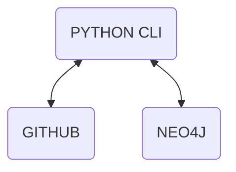

### Overview

Knowledge Graph Tools contain CLI tools written in `python` to create a 
knowledge graph for any `Github` repo:

```
GitHub Repo
   ↓
kgtools repo <repo> stats
   ↓
kgtools repo <repo> tree
   ↓
kgtools repo <repo> parse   (future)
   ↓
entities → Neo4j
```

The aims for the resulting knowledge graph are:
1. Answer questions about the codebase directly: like how a repo's files, 
   classes, functions, variables are connected
2. Answer questions about how the application logic interacts with the data 
   layer 
3. Enable a semantic search of the codebase using the GraphRAG pattern
4. Serve as the basis for LLM-related development - training data for 
   fine-tuning, chain-of-thought reasoning


### Service-layer components



* Github - remains the repo for codebase
  * The knowledge graph only stores patterns and relationships between codebase 
	artefacts 

* Neo4J - the storage option for the knowledge graph
  * Examples use Neo4j Desktop
  * Possible to swap Neo4j for any number of alternative graph storage 
    technologies - RDF triplestores, Elasticsearch, etc

### Installation

1. Sample `.env`
```
NEO4J_URI=bolt://localhost:7687
NEO4J_USERNAME=neo4j
NEO4J_PASSWORD=pw-for-your-neo4j-dbms
GITHUB_TOKEN=from-github
```

2. Install Python packages from `Pipfile`
```
>pip install pipenv 

>pipenv install

>pipenv shell

>pipenv graph 
```

3. Repo structure

```
	graphrag-code-kg/
	│
	├── pyproject.toml
	├── README.md
	├── .env
    │
	├── notebooks/					   # Experimental code + presentations
	│
	├── src/
	│   └── codebase_kg/
	.		.
	│		├── services/                      # Backend integration APIs       
	.               .          
	│               ├─ cli/				   # Thin API interface layer 
	.		.
	│		├── schemas/			   # Software architecture schemas 
	.		.
	│		├── data_kg/                       # Database metadata ingestion
	.               .
	│		├── app_kg/                        # Business logic metadata ingestion
	.               .
	│		└── graph_queries/                 # Deterministic graph intelligence
	.
	├── tests/					   # Test-driven development repo 
	.
	├── graphrag/                                      # Graph-LLM interaction
	.
	└── docs/                                          # MkDocs code documentation site
```
