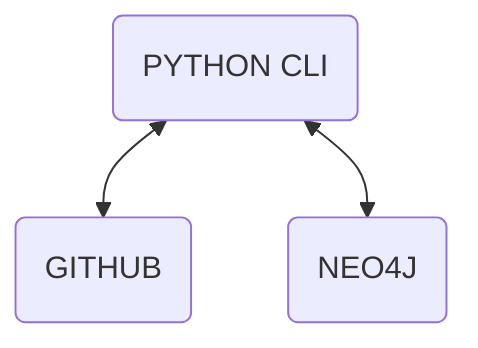

### Overview

Knowledge Graph Tools contain a set of `Python` CLI tools to create a 
knowledge graph for any codebase repo. The aims for the resulting knowledge 
graph are:
1. Answer questions about the codebase directly: like how a repo's files, 
   classes, functions, variables are connected
2. Answer questions about how the application logic interacts with the data 
   layer
3. Enable a semantic search of the codebase when coupled with an LLM, using the 
   GraphRAG pattern

### Infrastructure components



* Github - remains the repo for codebase
  * The knowledge graph only stores patterns and relationships between the codebase 
	artefacts 

* Neo4J - the storage option for the knowledge graph
  * Examples use Neo4j Desktop
  * Possible to swap Neo4j for any number of alternative graph storage technologies

### Installation

1. Sample `.env`
```
NEO4J_URI=bolt://localhost:7687
NEO4J_USERNAME=neo4j
NEO4J_PASSWORD=pw-for-your-neo4j-dbms
GITHUB_TOKEN=from-github
```

2. Install Python packages from `Pipfile`
```
>pip install pipenv 

>pipenv install

>pipenv shell

>pipenv graph 
```