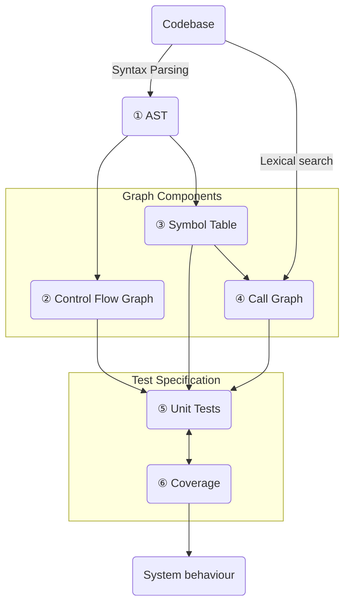

### appkg_workflow.png

```mermaid
flowchart TD
    A(Codebase)
    B(&#x2460 AST)
    subgraph Graph Components
        C(&#x2461 Control Flow Graph)
        D(&#x2462 Symbol Table)
        E(&#x2463 Call Graph)
    end
    subgraph Test Specification    
        F(&#x2464 Unit Tests)
        G(&#x2465 Coverage)
    end
    H(System behaviour)
    A-->|Syntax Parsing|B
    B-->C
    B-->D
    D-->E
    A-->|Lexical search|E
    C-->F
    D-->F
    E-->F
    F<-->G
    G-->H
```
