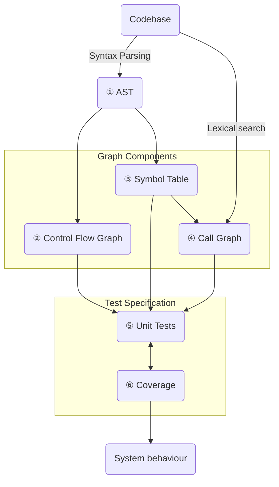
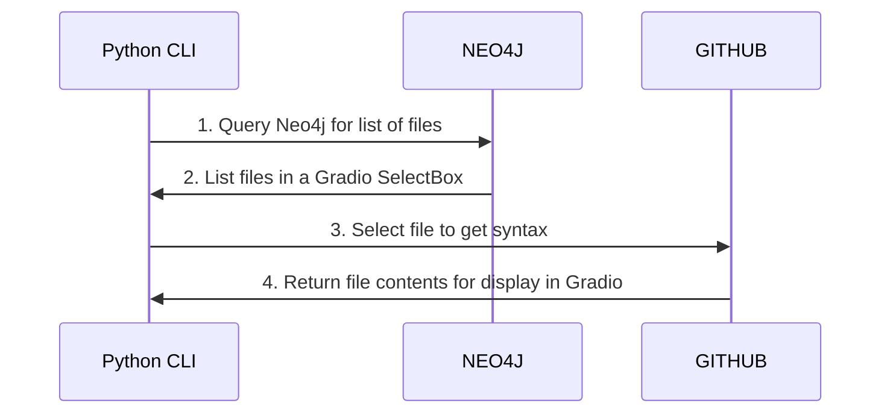

### appkg_workflow.png

```mermaid
flowchart TD
    A(Codebase)
    B(&#x2460 AST)
    subgraph Graph Components
        C(&#x2461 Control Flow Graph)
        D(&#x2462 Symbol Table)
        E(&#x2463 Call Graph)
    end
    subgraph Test Specification    
        F(&#x2464 Unit Tests)
        G(&#x2465 Coverage)
    end
    H(System behaviour)
    A-->|Syntax Parsing|B
    B-->C
    B-->D
    D-->E
    A-->|Lexical search|E
    C-->F
    D-->F
    E-->F
    F<-->G
    G-->H
```

### Gradio Interface

```mermaid
sequenceDiagram   
    participant A as Python CLI
    participant B as NEO4J
    participant C as GITHUB
    
    A->>B: 1. Query Neo4j for list of files
    B->>A: 2. List files in a Gradio SelectBox
    A->>C: 3. Select file to get syntax
    C->>A: 4. Return file contents for display in Gradio
```
